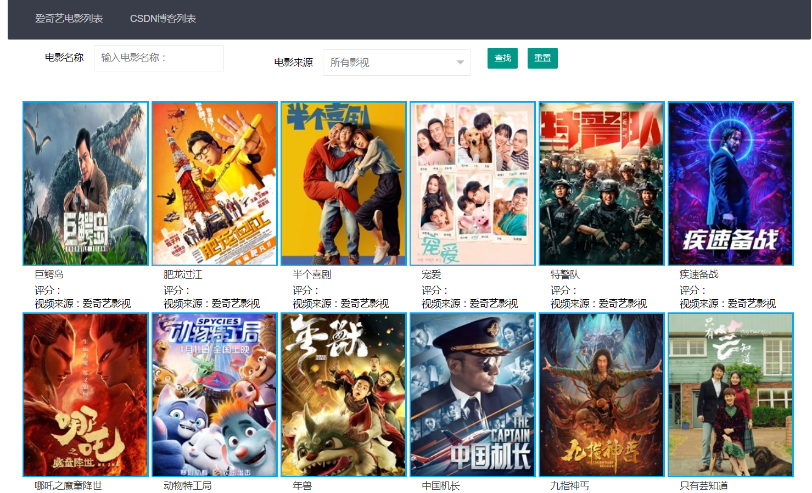
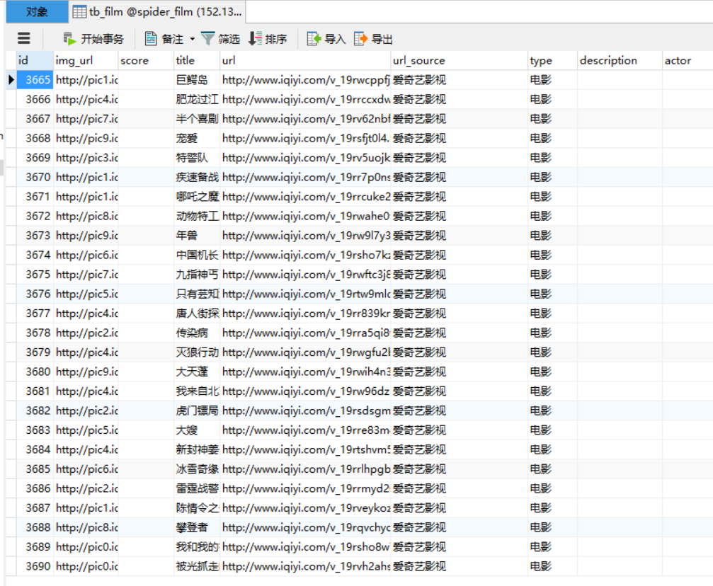
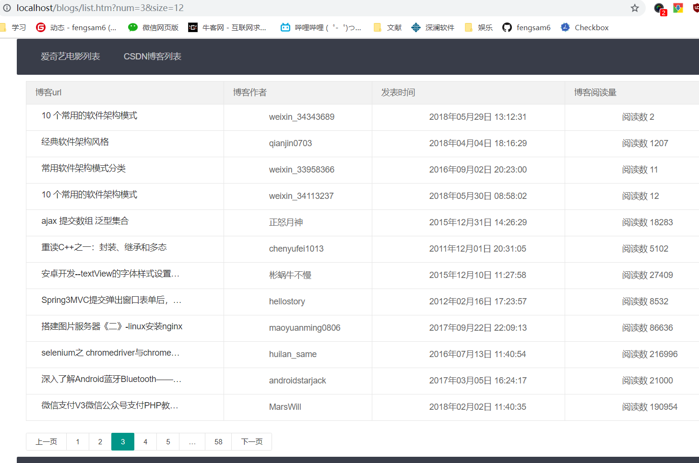
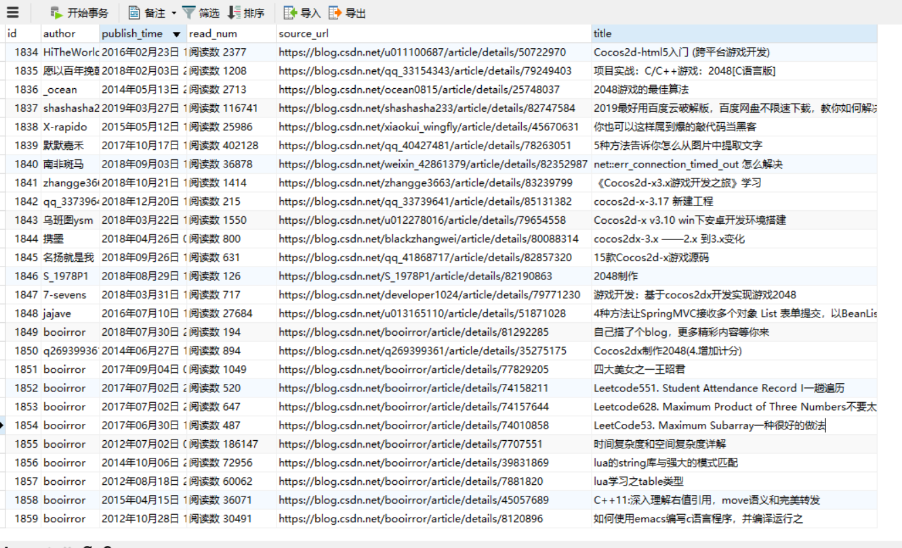
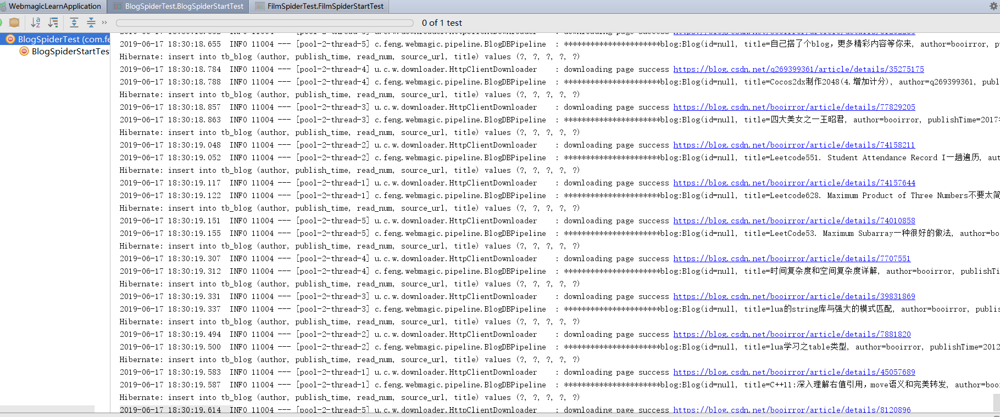

## webmagic-learn
### 介绍
1. 使用webmagic爬取CSDN博客，爬取爱奇艺视频，使用redis缓存爬虫爬过的url
### 后端技术
springBoot、mysql、springBoot Data JPA、webmagic、redis

### 运行效果

1. 电影列表页面

   > ​         使用webmagic从爱奇艺官网上爬取电影标题、url等数据，并且将爬虫数据存放MySQL数据库中。电影列表页面渲染如下，点击解析播放可以播放该视频。

2. 电影列表数据库数据

   > 使用webmagic从爱奇艺官网爬取数据，并且将数据存放mysql数据中。

   

   

   

   

   3. CSDN博客列表页面

      > ​       使用webmagic从CSDN网站爬取数据，并且将数据存放mysql数据中。博客列表页面渲染如下，点击博客标题可以查看博客内容。

   

   

   

   4. CSDN博客列表数据库中的爬虫数据

      > 使用webmagic从CSDN网站爬取数据，并且将数据存放mysql数据中。

      

      

   5. 从CSDN爬取博客数据，效果如下图。

      

### 本地运行

1. 执行git clone git@gitee.com:fengsam618/webmagic-learn.git,将项目导入idea中
2. 将sql文件夹下spider_film.sql在Navicat中执行

* 成功执行会创建两张表

2. 修改resource目录下 application-dev.properties

3. 重点修改连接数据库名称、登录用户名称、密码
4. 启动成功后，浏览器访问http://localhost/

### 待完成

1. 电影列表，支持多种搜索（根据电影名称、时间）
2. 电影图片url错误，待解决

3. 数据支持增量插入，定时插入

4. 视频支持切换播放线路，vip视频解析url

### 备注
1. 寻找小伙伴一起开发
2. .视频解析如果有侵权，请停止使用